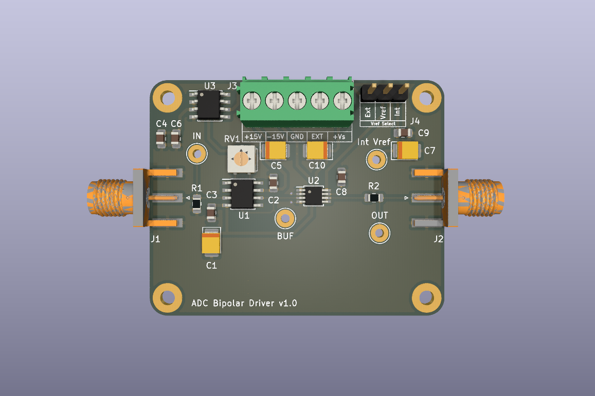
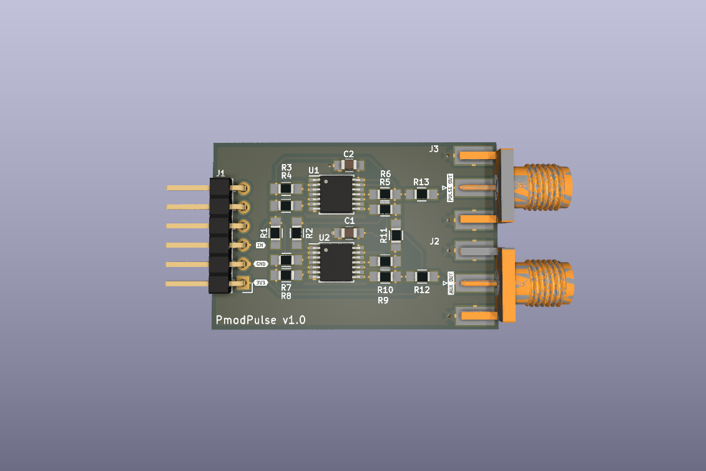
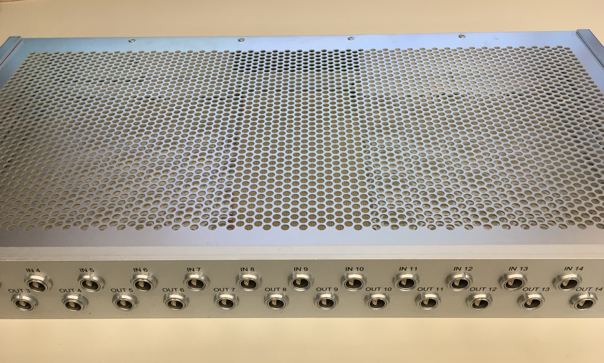
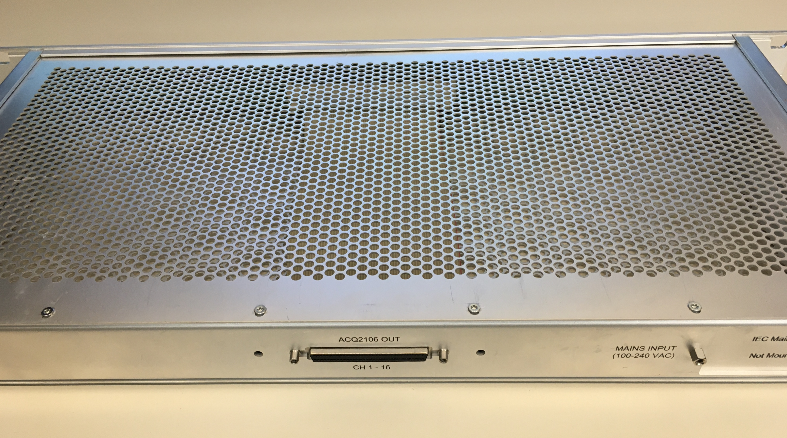
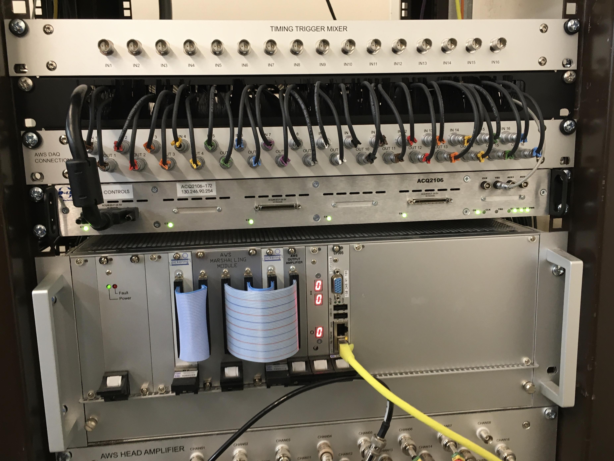
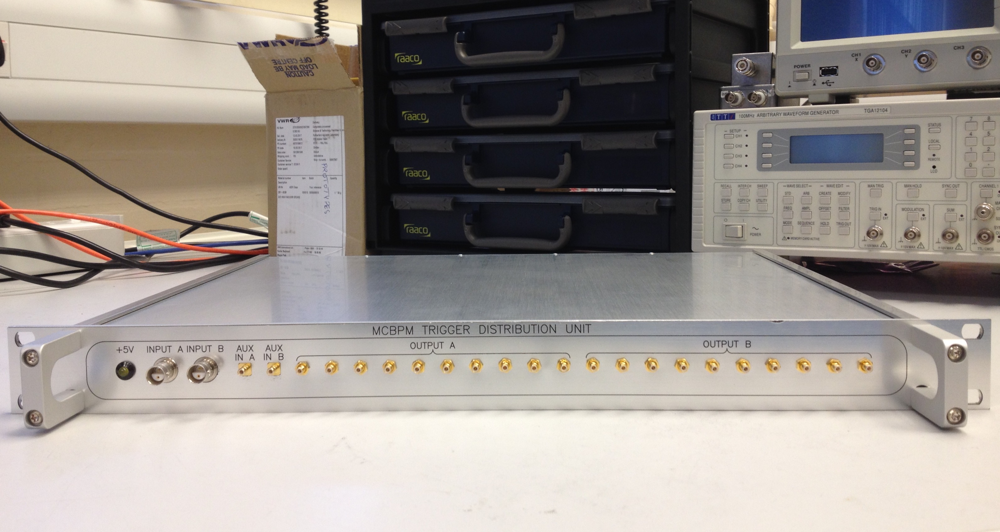
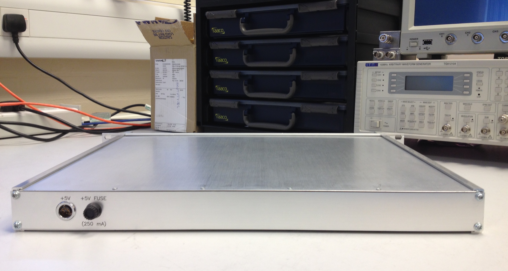
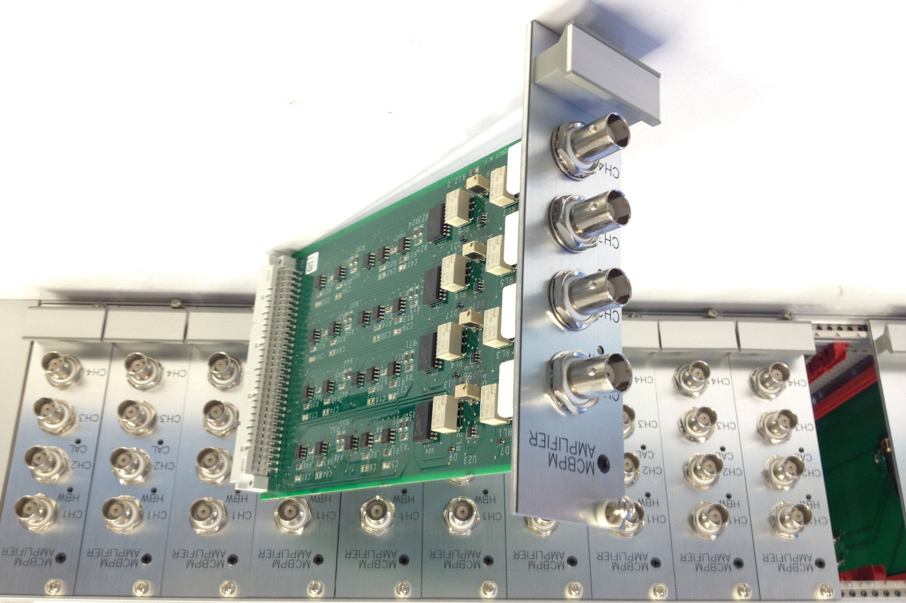
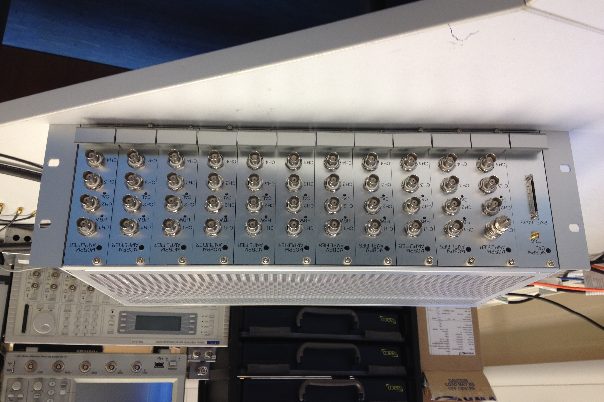

Title: Portfolio

# Bipolar ADC driver

Single channel ADC front-end for driving medium speed, 16-bit SAR ADCs from a
bipolar input.

## Features
* Default level translation: +/-12 V -> 0 - +5 V.
* 15 MHz bandwidth.
* 50 ohm or high input impedance (10^13 ohm).
* Low noise/distortion: Vn = 4 μVp-p, THD + N = 106 dB.
* High CMRR: 80 dB.
* Select on-board (+5 V) or external voltage reference, for configurable ranges.
  

# Pmod Pulse

Configurable dual channel digital output for driving lengths of terminated
coaxial cable from microcontrollers / FPGAs.

## Features
* Up to 2 digital outputs on SMA connectors.
* TTL output levels.
* Up to 256 mA max. output current capability (configurable with zero-ohm resistors).
* Optional AUX output (configurable with zero-ohm resistors).
* Optional back termination resistors for double-ended or series termination.
* 6-pin Digilent Pmod Interface Specification compatible.
  

# Dual Voltage Regulator

Dual fixed voltage regulator module based on LM78XX / LM79XX.

## Features
* +7-38 V input -> +5-24 V output, -7-30 V input -> -5-15 V output.
* Output current: up to 1.5 A.
* Voltage regulators: 1 x LM78XX, 1 x LM79XX.
* Reverse voltage protection.
* On board and external power LED indicators.
  

# Data Acquisition Connection Unit

Multi-channel signal connection unit designed for a data acquisition system at a
scientific facility.

## Features
* 1U, 19" rack mount aluminium chassis.
* Designed for +/- 10 V differential input signals.
* x16 inputs (dual pin LEMO connectors) on front.
* x16 outputs (dual pin LEMO connectors) on front.
* x16 outputs (68 way SCSI connector) on rear.
* Transient protection on all inputs (bi-directional TVS diodes: +/-30 V clamp,
1.5 kW peak pulse).
* Optional IEC mains inlet connector, if internal power is required.
  

# Trigger Distribution Unit

Bespoke unit for distributing timing triggers for an ion detector data acquisition
system.

## Features
* 1U, 19" rack mount aluminium chassis.
* Fan-out two independent differential trigger inputs (BNO connectors) to x8 single-ended outputs (SMB connectors).
* Optional single-ended AUX inputs (SMB connectors).
* Buffered outputs for driving TTL levels into 50 ohm loads.
* +5 V power LED indicator.
* Fused +5 V external power input on rear (LEMO connector).
  

# Current Amplifier Eurocrate

Modular 4 channel current amplifiers in Eurocard format for an ion detector data
acquisition system.

## Features
* Transimpedance gain of 3000.
* Relay selectable 10 kHz or 30 MHz bandwidth.
* 50 ohm input impedance.
* Up to 40 channels in a Eurocard crate.
* Pulse generator card with external trigger for testing and calibration.
  

