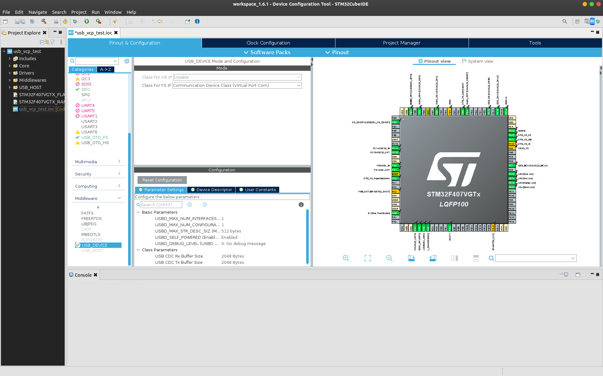
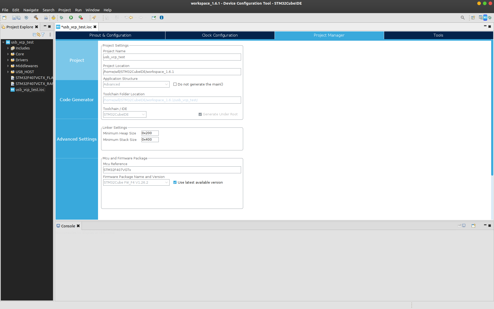
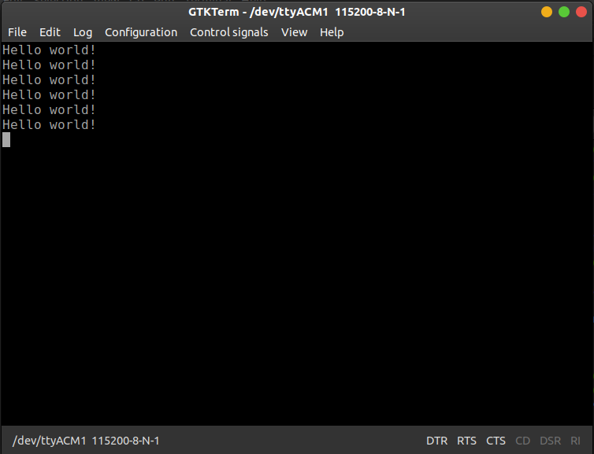

Title: STM32: USB Virtual COM Port (VCP)
Date: 2022-02-13 16:44
Modified: 2022-02-13 16:44
Category: STM32
Tags: STM32, ARM, linux, programming
Slug: stm32-vcp
Authors: Will Frank
Summary: How to configure the USB peripheral of STM32 microcontrollers as a virtual COM port.

Serial communication is really useful for interfacing microcontrollers with
external devices (GPS, WiFi, Bluetooth modules) or to a host PC for debugging or
data transfer. For STM32 devices a USB-UART bridge can be used to communicate
with a USB device such as a PC. However, many of the STM32 development boards
have a USB peripheral on-board. This tutorial covers setting up the STM32F4
Discovery board as a virtual COM port (VCP) to enable USB communication to and
from a PC.

I'm using the STM32 Discovery board which has an STM32F407VG microcontroller and
an on-board micro USB port. I'm using the STM32 Cube Framework with the HAL
libraries and USB device middleware for this application. I'm developing on a PC
running Ubuntu 20.04.3.

First, open STM32CubeIDE and start a new STM32 project
**File > New > STM32 Project**. Select your microcontroller or development board.
Here I select the STM32F4 Discovery (STM32F407G-DISC1).


Click **Next >**, name your project (e.g. "usb_vsp_test") and leave the rest as
default. We'll be using C as our programming language in this example. Click
**Finish**, and you'll be prompted for a couple of settings:

* **Yes**, to "Initialize all peripherals with their default Mode?"
* **Yes**, to "Open this perspective now"

Now in the STM32 CubeMX configuration perspective, Under the **Pinout &
Configration** tab in the **System Core** section, select **RCC**. Then, under
**RCC Mode and Configuration**, enable the High Speed External (HSE) clock and
select Ceramic/Crystal Resonator. Note: this may already be configured by
default.


In the **Connectivity** section select **USB_OTG_FS** and confuigure the mode as
**Device_Only**. You can also disable **Activate_VBUS**. On the STM32F4
Discovery pins PA11 and PA12 are configured for OTG_FS_DM and OTG_FS_DP.


Finally, under the **Middleware** section, select the **USB_DEVICE** and set the
**Class For FS IP** as **Communication Device Class (Virtual Port Com)**. Leave
the **Configuration > Parameter Settings** as default.



Next, save the CubeMX (.ioc) file to generate the code. Click **File > Save** to
save the changes to the CubeMX configuration. You’ll be asked if you want to
generate code. Click **Yes**.

Now all the peripherals are enabled for the USB communication over VCP. But as
the HAL USB stack is heavy on the memory, the minimum heap size needed has to be
changed. This can be changed by opening the **Project Manager** tab and changing
the **Minimum Heap Size** to ```0x600``` under **Linker Settings**.



Click **File > Save** to save the changes to the CubeMX configuration. You’ll be
asked again if you want to generate code. Click **Yes**.

## Serial Echo

Lets test this setup with a simple echo application using the USB CDC. First
open the ```USB_DEVICE > App > usbd_cdc_if.c``` file. Find the
```CDC_Receive_FS``` function and edit:
```C
static int8_t CDC_Receive_FS(uint8_t* Buf, uint32_t *Len)
{
    /* USER CODE BEGIN 6 */
    USBD_CDC_SetRxBuffer(&hUsbDeviceFS, &Buf[0]);
    USBD_CDC_ReceivePacket(&hUsbDeviceFS);
    CDC_Transmit_FS(Buf, *Len);
    return (USBD_OK);
    /* USER CODE END 6 */
}
```
Note that ```CDC_Receive_FS``` is a static function so cannot be called outside
of ```usbd_cdc_if.c```. This code takes characters from the recieve buffer and
sends them straight back out again using the CDC transmit function.

Now build the project and download the program to the board using the built in
ST-Link. Click **Project > Build All** to build the project. Click
**Run > Debug As > STM32 MCU C/C++ Application**. A pop-up window will appear
asking you to create a new launch configuration. Note that if you are not using
a Nucleo/Discovery board or an ST-LINK, you can change the hardware debugger
(e.g. to a Segger J-LINK) in the Debugger tab. If you are using a
Nucleo/Discovery, leave everything as default and click **OK**.

When connected to your host PC by the micro USB (next to the audio jack on the 
STM32F4 Discovery board), the serial port should show up as ```/dev/ttyACM1```
on most Linux distributions. Start up your favourite serial port terminal, such
as gtkterm and open ```ttyACM1```. The baud rate doesn't matter as it's ignored
by the progam. On Ubuntu:

```shell
sudo apt-get install gtkterm
sudo gtkterm
```

Set the following serial port settings:
the following connection details:

* Port: ttyACM1
* Baud rate: 115200 (default)
* Data bits: 8 (default)
* Parity: None (default)
* Stop bits: 1 (default)

Type a message in the serial monitor and press send. The STM32 device will
echo back the message you typed!

## Controlling a built-in LED using the VCP
The Virtual COM Port (VCP) opens up the possibility of remote control of the
STM32. As a simple example, the built-in LED on the STM32F4 Discovery can be
turned on and off using the VCP.

First, open the CubeMX (.ioc ) file again to generate the code for the LED. In
the CubeMX perspective, select the pin for the LED (which is PD13 for the orange
LED on the STMF4 Discovery board) and set as **GPIO_Output**. Note, if you setup
all peripherals with their default mode, this will already be done. Now save the
file to generate the code again. Next change the ```CDC_Receive_FS``` function
in ```USB_DEVICE > App > usbd_cdc_if.c``` as follows:

```C
static int8_t CDC_Receive_FS(uint8_t* Buf, uint32_t *Len)
{
    /* USER CODE BEGIN 6 */
    USBD_CDC_SetRxBuffer(&hUsbDeviceFS, &Buf[0]);
    USBD_CDC_ReceivePacket(&hUsbDeviceFS);
    if(Buf[0] == '1')
    {
        HAL_GPIO_WritePin(GPIOD, GPIO_PIN_13, GPIO_PIN_SET);
    }
    else if(Buf[0] == '0')
    {
        HAL_GPIO_WritePin(GPIOD, GPIO_PIN_13, GPIO_PIN_RESET);
    }
    return (USBD_OK);
    /* USER CODE END 6 */
}
```
Here we check the USB receive buffer to see if we got either ```0``` or ```1```.
If we get ```1``` we turn the LED on with ```HAL_GPIO_WritePin()```. If we get
```0``` we turn the LED off.

## Hello World!
Start with a new USB VCP project following the steps above. Open up ```Src >
main.c```. At the top, under ```/* USER CODE BEGIN Includes */``` , include the 
USB CDC library header:
```C
#include "usbd_cdc_if.h"
```
This will let us call functions from the USB CDC library in our main program.
Scroll down to our ```while(1)``` loop in main. Under
```/* USER CODE BEGIN 3 */``` (but still inside the while loop), enter the
following:
```C
uint8_t msg_buffer[] = "Hello world!\r\n";
CDC_Transmit_FS(msg_buffer, sizeof(msg_buffer));
HAL_Delay(1000);
```
Here we create a simple message string and use the USB CDC transmit function to
send the string over USB. We then wait for 1 second before repeating this action
for ever!

Build and run the project as before. Open the serial connection, and you should
be greeted by that oh-so-familiar phrase, repeating over and over again:

